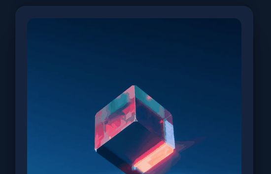
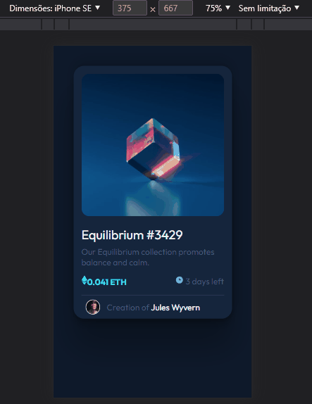

# Frontend Mentor - NFT preview card component solution

This is a solution to the [NFT preview card component challenge on Frontend Mentor](https://www.frontendmentor.io/challenges/nft-preview-card-component-SbdUL_w0U). Frontend Mentor challenges help you improve your coding skills by building realistic projects. 

## Table of contents

- [Overview](#overview)
  - [The challenge](#the-challenge)
  - [Screenshot](#screenshot)
  - [Links](#links)
- [My process](#my-process)
  - [Built with](#built-with)
  - [What I learned](#what-i-learned)
  - [Continued development](#continued-development)
  - [Useful resources](#useful-resources)
- [Author](#author)
- [Acknowledgments](#acknowledgments)

## Overview

Foi um desafio e tanto, fico feliz que consegui um resultado satifatorio, onde cheguei ao meu ver o mais proximo do resultado possivel, fico aberto para melhorias, gostaria de receber seu feedback. &#128512;

### The challenge

Users should be able to:

- View the optimal layout depending on their device's screen size
- See hover states for interactive elements

### Screenshot
Este é o modelo do meu site em um desktop

Este é o modelo do meu site em um celular


### Links

- Solution URL: [https://github.com/Vitor5782/Projeto-2-FrontEndMentor](https://github.com/Vitor5782/Projeto-2-FrontEndMentor)
- Live Site URL: [https://vitor5782.github.io/Projeto-2-FrontEndMentor/](https://vitor5782.github.io/Projeto-2-FrontEndMentor/)

## My process

### Built with

- Semantic HTML5 markup
- CSS custom properties
- Flexbox
- CSS Grid
- Mobile-first workflow


### What I learned

Aprendi o uso do z-index, que funciona a fim de me mostrar o que está acima do que, que atravez do uso deste consegui inserir o icone svg "view".
Alem do uso de pseudo-elementos como o "::before" e "::after".
No meu html tiver orgulho de manter a semantica, mas creio que ainda posso melhorar.
Quanto ao css fico muito feliz que com ajuda conseguir montar o que desejava atravez do uso dos pseudo-elementos:

```css
.imagem-hover:hover::before {
   cursor: pointer;
    content: "";
    position: absolute;
    width: 90%;
    height: 95%;
    background-color: hsl(178, 100%, 50%);
    opacity: 0.5;
    z-index: 2;
    border-radius: 15px;
    margin-top: 4%;
}
```

### Continued development

Preciso melhorar em muito meu conceito de div pai para filho, assim podendo ter melhor desempenho ao fazer meu layout.
Tambem preciso continuar a melhorar minha semantica.
No css sei que tenho uma longa jornada para melhorar como alinho meus elementos alem de como faço para deixa-los como desejo.

## Author

- Website - [Vitor Hugo Teixeira](https://github.com/vitor5782)
- Frontend Mentor - [@Vitor5782](https://www.frontendmentor.io/profile/Vitor5782)
- Facebook - [@vitorhugoteixeira](https://www.facebook.com/vitor.hugo.3591267/)

## Acknowledgments

Tenho que agradeçer em muito o Raphael, da equipe do curso DEV QUEST.
Tambem agradeço o curso em si que é maravilhoso.
